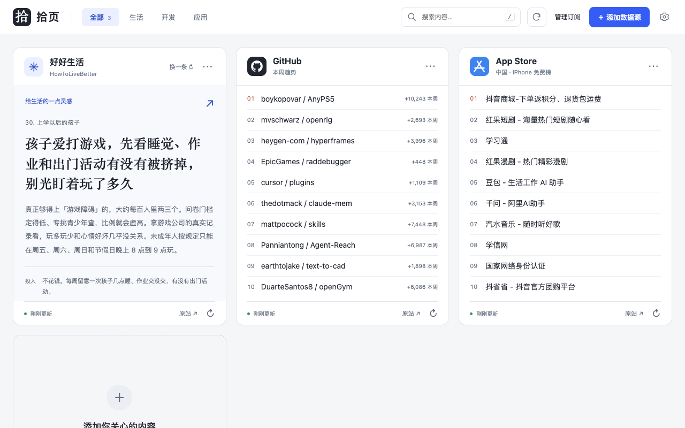
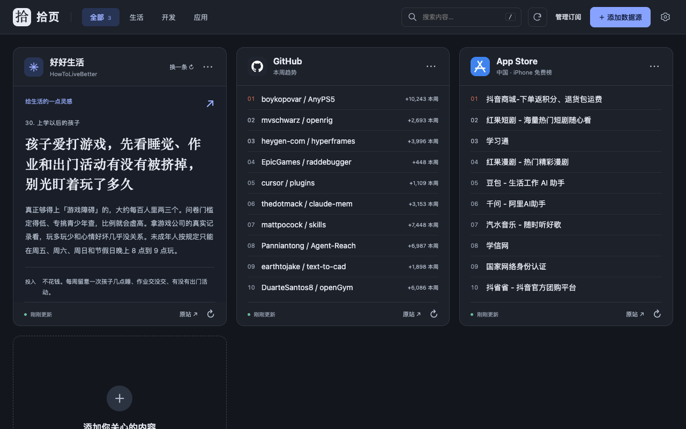

<div align="center">
  
  <h1>拾页 · Shiye Tab</h1>
  <p><strong>每次打开，拾一点新知。</strong></p>
  <p>把生活灵感、开发趋势和自己的订阅，放进 Chrome 新标签页。</p>
  <p>
    <a href="https://chromewebstore.google.com/detail/%E6%8B%BE%E9%A1%B5-%C2%B7-shiye-tab/fkkcecjdalionkdjbpdhgigpcimopfmg?hl=zh">从 Chrome 应用商店安装</a> ·
    <a href="#从源码安装">从源码安装</a> ·
    <a href="https://github.com/sinyu1012/shiye-tab/issues">反馈问题</a>
  </p>
  <p>Manifest V3 · 无运行时依赖 · 本地存储 · MIT 开源</p>
</div>



> 截图中的内容来自公开数据源，仅展示拍摄时的结果，实际内容随上游更新。GitHub 源码可能先于商店版本更新。

## 你可以用它做什么

- **打开即读**：随机一条生活建议、GitHub 周榜、App Store 中国免费榜，默认三张卡片。
- **订阅自己的内容**：支持 RSS、Atom、JSON Feed、提供 RSS 的 Newsletter，以及自定义字段映射的 JSON 接口。
- **一条内容，展开阅读**：显示条数设为 `1` 时，自动使用大标题与展开摘要的阅读卡片；摘要保留换行与段落边界。多条内容使用列表。
- **整理自己的看板**：编辑、删除、拖动或按钮排序；分类筛选、搜索已加载内容；配置导入与导出。
- **选择阅读外观**：浅色、深色或跟随系统，桌面支持 2 / 3 / 4 列，窄屏自动调整。
- **按需刷新**：每个来源独立设置缓存时长，支持单卡与全部刷新；更新失败时保留旧缓存并标记原因。

<details>
<summary>查看深色模式</summary>



</details>

## 安装

### Chrome 应用商店

打开 [拾页 · Shiye Tab 商店页面](https://chromewebstore.google.com/detail/%E6%8B%BE%E9%A1%B5-%C2%B7-shiye-tab/fkkcecjdalionkdjbpdhgigpcimopfmg?hl=zh)，点击「添加至 Chrome」。打开新标签页后，按 Chrome 提示保留新标签页变更。

如果同时安装了多个新标签页扩展，请在 Chrome 中选择拾页作为生效的新标签页。

### 从源码安装

```sh
git clone https://github.com/sinyu1012/shiye-tab.git
```

1. 打开 `chrome://extensions`，开启右上角「开发者模式」。
2. 点击「加载已解压的扩展程序」，选择刚下载的 `shiye-tab` 目录（包含 `manifest.json`）。
3. 打开新标签页。

**使用源码版无需 Node.js，也无需构建。** 更新源码后，在扩展管理页点击「重新加载」，再打开新标签页。也可按下文开发步骤构建后加载 `dist/`。

## 数据源

| 来源 | 展示内容 | 说明 |
| --- | --- | --- |
| [HowToLiveBetter](https://github.com/eternity4719/HowToLiveBetter) | 随机生活建议 | 保留章节、投入、证据等级、备注与原文链接 |
| [GitHub Trending](https://github.com/trending?since=weekly) | 本周热门仓库 | 按官方周榜顺序，展示本周新增星标 |
| Apple iTunes RSS | 中国区 iPhone 免费应用 Top 10 | Apple 官方数据，与七麦榜单独立 |
| RSS / Atom / JSON Feed | 文章、简报、更新 | 使用发布者提供的订阅地址 |
| 通用 JSON | 自定义结构化内容 | 配置列表路径与字段映射 |
| 七麦 JSON（可选） | 中国区 iPhone 免费总榜 Top 10 | 需要自行提供有权访问的接口，不内置可用榜单服务 |

生活建议缓存目录中所有章节的条目。每次打开和「换一条」都从缓存条目中随机选择，优先避开上一条所在的章节；只有一个章节时避开上一条，只有一条内容时仍可展示。「刷新」重新获取所有章节。首次获取需要下载多个章节，后续在缓存有效期内直接从本地选择。七麦不再默认添加占位卡片，仍可通过「添加数据源」自行配置。

### RSS 与 Newsletter

1. 点击「添加数据源」，选择「RSS / Atom / Newsletter」。
2. 填写卡片名称、分类和订阅地址。Newsletter 请使用发布者的 RSS / Atom 链接；扩展不读取邮箱。
3. 设置显示条数和缓存时长，保存时按 Chrome 提示授权该站点。

显示条数设为 `1` 适合每日简报和长摘要；设为多条适合新闻列表。摘要最多保留 500 个字符，完整内容通过原文链接阅读。刷新按钮会立即重新请求，不必等缓存过期。

### JSON 接口

假设接口返回：

```json
{
  "data": {
    "articles": [
      {
        "name": "今天值得读的一篇文章",
        "link": "https://example.com/article",
        "summary": "第一段内容。\n第二段内容。",
        "score": "42"
      }
    ]
  }
}
```

在「JSON 接口」中填写以下映射：

| 配置项 | 值 |
| --- | --- |
| 列表路径 | `data.articles` |
| 标题 | `name` |
| 链接 | `link` |
| 摘要 | `summary` |
| 辅助信息 | `score` |

根节点就是数组时，列表路径留空。映射只读取属性路径，不执行 JavaScript。不支持 POST 或自定义认证请求头；如需聚合或鉴权，可使用自己的服务。

### 地址与权限

推荐使用 HTTPS。添加或重新连接来源时，只申请对应站点的访问权限；导入配置不会自动授权新站点。

HTTP 仅支持源码中明确列出的本地白名单（见 `src/model.js` 的 `httpHosts` 与 `manifest.json` 的 `optional_host_permissions`），包含 `localhost` 和 `127.0.0.1`。自部署其他局域网 HTTP 源时，需在这两处加入相同的具体主机，并重新加载扩展；不要改成所有 HTTP 站点通配。

遇到连接失败时，先检查订阅地址是否可访问，再点击卡片中的「连接数据源」授权。普通网页预览受 CORS 限制，正式使用应加载扩展。上游结构变化或访问限制也可能导致某个来源暂时不可用。

## 隐私

- 无账号、无开发者服务端、无遥测或广告 SDK。
- 配置、订阅地址和缓存保存在本机 `chrome.storage.local`。
- 不申请浏览历史、标签页或邮箱权限，不向普通网页注入脚本。
- 请求直接发往数据源，使用 `credentials: omit` 和 `no-referrer`；远端内容仅解析为数据。
- 删除卡片会清除对应缓存；已授予的站点权限可在 Chrome 扩展详情中撤销。

导出的配置可能包含私有订阅地址或 URL 中的令牌，分享前请检查。完整说明见 [隐私政策](store/PRIVACY.md)。

## 开发

原生 JavaScript ES Modules + CSS + Chrome Manifest V3，没有生产依赖。开发验证使用 Node.js 22+ 和 Playwright。

```sh
npm ci
npm run check                 # 应用模块语法检查
npm test                      # 配置与模型测试
npm run build                 # 白名单复制运行文件到 dist/
npx playwright install chromium
npm run test:extension        # Chromium 扩展交互回归，使用固定测试响应
npm run test:extension -- --live  # 可选：验证真实上游，依赖网络与源可用性
```

测试使用独立临时 Chromium profile，不加载个人 Chrome 配置。结果与截图保存在 Git 忽略的 `artifacts/`。`npm run dev` 提供 `http://127.0.0.1:5173` 网页预览；跨域授权需要扩展环境。

```text
manifest.json          扩展入口与权限
index.html / styles.css 页面结构与主题
src/app.js             看板、阅读卡片与交互
src/model.js           默认配置、输入验证与 URL 规则
src/sources.js         数据获取、解析与源适配
src/storage.js         本地存储、缓存与站点授权
scripts/               构建、预览与商店素材工具
tests/                 模型与扩展运行验证
store/                 商店文案、截图与隐私政策
docs/                  产品、技术设计、设计稿与验收记录
```

更多说明：[产品目标](docs/PRD.md) · [技术设计](docs/TECHNICAL_DESIGN.md) · [验收记录](docs/VERIFICATION.md)。

## 参与贡献

欢迎通过 [Issues](https://github.com/sinyu1012/shiye-tab/issues) 反馈问题或提交 Pull Request。反馈时请附上复现步骤、Chrome 版本和脱敏示例；不要提交私有订阅地址、令牌或个人配置。修改解析器时请提供最小示例，修改交互时请验证实际扩展页面。

## 许可证与致谢

拾页原创代码采用 [MIT License](LICENSE)。第三方内容、商标和标识不因本项目开源而改变其授权归属。

感谢 [eternity4719 / HowToLiveBetter](https://github.com/eternity4719/HowToLiveBetter) 及其贡献者。其正文采用 [CC BY 4.0](https://creativecommons.org/licenses/by/4.0/)；拾页节选原文字段、去除 Markdown 标记并保留署名与原文链接。其他来源内容及标识归各自权利人所有，项目不代表 GitHub、Apple 或七麦官方。
